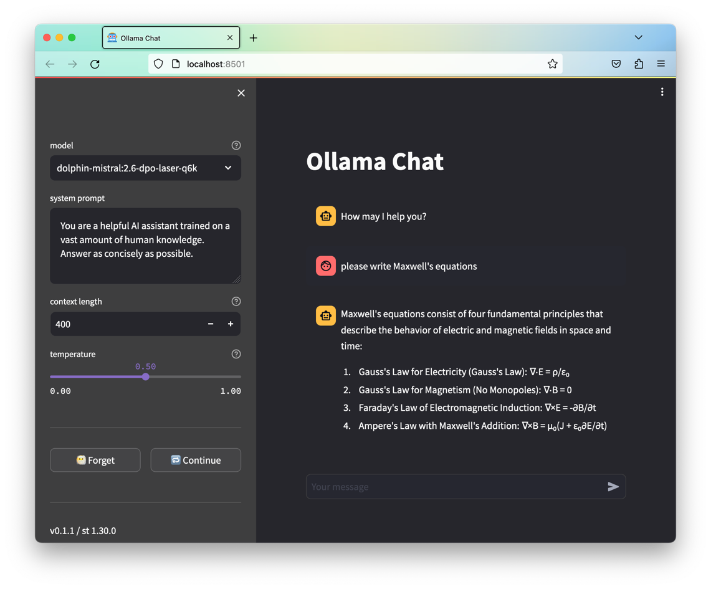

# Ollama Chat

A hackish web frontend for ollama.



## Install

Install [Ollama](https://ollama.ai/) and run the server.

Download some [models](https://ollama.ai/library). For example, one of my favorites:

```shell
$ ollama pull dolphin-mistral:7b-v2.6-dpo-laser-q6_K
```

Install the web ui

```shell
$ ./install.sh
```

Or to install using latest versions of the libs (may break functionality):

```shell
$ ./install.sh refresh
```

## Run

```shell
$ ./run.sh
```
